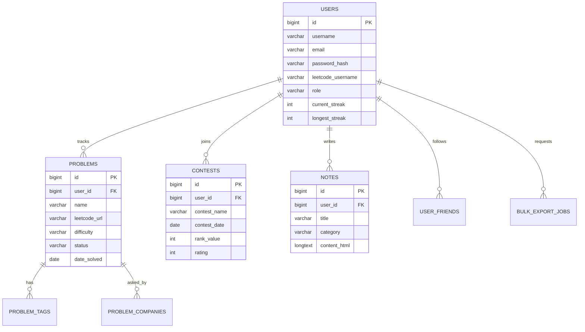

# Entity Relationship Diagram

```mermaid
erDiagram
  USERS ||--o{ PROBLEMS : tracks
  USERS ||--o{ CONTESTS : joins
  USERS ||--o{ NOTES : writes
  USERS ||--o{ USER_FRIENDS : follows
  USERS ||--o{ BULK_EXPORT_JOBS : requests
  PROBLEMS ||--o{ PROBLEM_TAGS : has
  PROBLEMS ||--o{ PROBLEM_COMPANIES : asked_by

  USERS {
    bigint id PK
    varchar username
    varchar email
    varchar password_hash
    varchar leetcode_username
    varchar role
    int current_streak
    int longest_streak
  }

  PROBLEMS {
    bigint id PK
    bigint user_id FK
    varchar name
    varchar leetcode_url
    varchar difficulty
    varchar status
    date date_solved
  }

  CONTESTS {
    bigint id PK
    bigint user_id FK
    varchar contest_name
    date contest_date
    int rank_value
    int rating
  }

  NOTES {
    bigint id PK
    bigint user_id FK
    varchar title
    varchar category
    longtext content_html
  }
```
